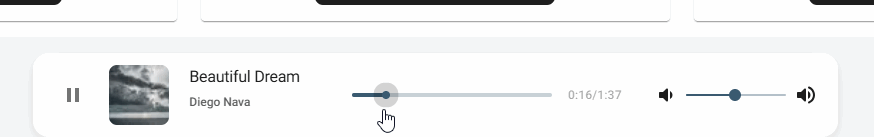

# 🎵 Music App

This is a fullstack music application built for practicing modern web development.  
It is developed using **Next.js**, **Material UI**, **React**, and **Redux Toolkit**, with backend functionality handled via **Next.js API routes**.

The app allows you to play tracks, control playback (play/pause), adjust volume, and serves as a foundation for a more complete music service, including server-side track management and API integration.

## Features

This music app provides a set of core functionalities to enjoy and manage your music experience. Key features include:

- Track list: listen public or your uploaded tracks
  

- Track playback (play/pause, seek)
  

## 🚀 Installation / Local Setup

Follow these steps to run the project locally:

1. **Clone the repository**

```bash
git clone https://github.com/Mishaguk/Music-application.git
cd music-app
```

2. **Install dependencies**

````bash
npm install
# or
yarn install```
````

3. **Create a `.env.local` file**

Create a `.env.local` file in the root folder and add the following environment variables:
`
MONGO_URL=

NEXT_PUBLIC_CLOUDINARY_CLOUD_NAME=
NEXT_PUBLIC_CLOUDINARY_UPLOAD_PRESET=
NEXT_PUBLIC_CLOUDINARY_API_URL=

NEXT_PUBLIC_API_URL=http://localhost:3000`

4. **Run the development server**

```bash
npm run dev
# or
yarn dev
```

5. **Open in browser**
   Navigate to http://localhost:3000 to see your app running.
